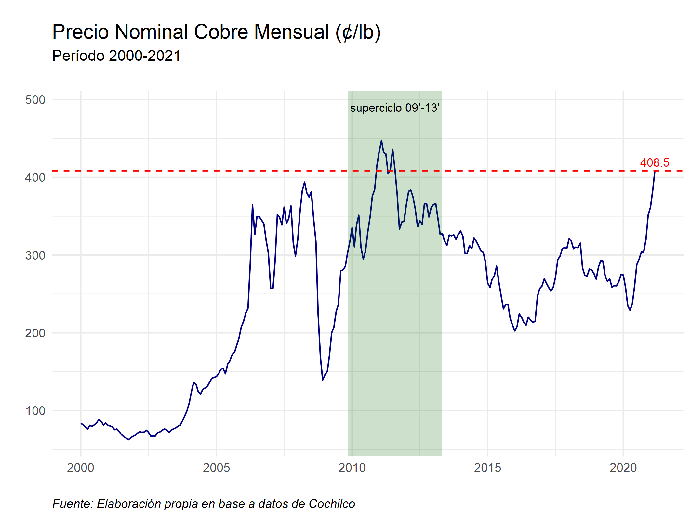

<style>
body {
text-align: justify}
</style>

```{r setup, include=FALSE}
knitr::opts_chunk$set(echo = FALSE)
```

# Paso a paso

## Base de datos

Debemos ir a [Precios de los Metales e Inventarios
](https://boletin.cochilco.cl/estadisticas/grafico.asp?tipo_metal=1) y descargar los datos. En este caso, trabajaremos con el precio mensual del período Ene2000-Mar2021 (LME).

## Librerías
Deben haber sido previamente instaladas con el comando **install.packages()**.

```{r, echo=TRUE}
library(readxl)
library(ggplot2)
library(tidyverse)
library(Cairo)

```

```{r}
setwd("~/Todo R/My Blog/_posts/2021-04-08-evolucin-del-precio-del-cobre")
```

## Importamos base

Debemos fijarnos en que la base esté guardada en formato *.xlsx*, al decargarla puede haber quedado en algún otro formato. Luego de importar, realizamos algunas modificaciones.

```{r, echo=TRUE}
df <- read_excel("datos.xlsx")

names(df)[1] <- "Fecha"
names(df)[2] <- "Precio"

df$Fecha <- as.Date(df$Fecha)

```

## Gráfico

### ggplot()/geom_line()

Comenzamos con un gráfico simple.

```{r, echo=TRUE}
graph <- ggplot(data = df, aes(Fecha, Precio)) +
  geom_line(colour = "navy")
graph
```

### labs()

Podemos agregar título, subtítulo, entre otras cosas.

```{r, echo=TRUE}
graph <- graph + labs(title = "Precio Nominal Cobre Mensual (¢/lb)",
                     subtitle = "Período 2000-2021",
       caption = "Fuente: Elaboración propia en base a datos de Cochilco",
       tag = "",
       x = "",
       y = "")
graph
```

### theme_minimal()

Añadimos un tema. Ver más opciones en [Complete themes](https://ggplot2.tidyverse.org/reference/ggtheme.html).

```{r, echo=TRUE}
graph <- graph + theme_minimal()
graph
```

### theme()

Editamos el tema: tamaño del título, subtítulo, fuente, margen, etc. Ver [Modify components of a theme](https://ggplot2.tidyverse.org/reference/theme.html#examples) para más detalles.

```{r, echo=TRUE}
graph <- graph +
  theme(plot.title = element_text(size = rel(1.35)),
        plot.subtitle = element_text(size = rel(1), margin=margin(0,0,20,0)),
        plot.caption = element_text(hjust = 0, face= "italic"))
graph
```


### annotate()

Agregamos un rectángulo sombreado para identificar algún período más relevante dentro del gráfico.

```{r, echo=TRUE}
graph <- graph +
  annotate("rect", fill = "darkgreen", alpha = 0.2,
           xmin = as.Date("2009-11-01"), xmax = as.Date("2013-05-01"),
           ymin = -Inf, ymax = Inf)
graph
```


### geom_point()/geom_text()

Podemos identificar un punto máximo y colocar una etiqueta. Creamos *graph2* porque no añadiremos esto en nuestro gráfico pirncipal.

```{r, echo=TRUE}
pmax <- df %>% #precio máximo
  slice(which.max(Precio))

graph2 <- graph +
  geom_point(data = pmax, aes(x = Fecha, y = Precio), col = "red",
             shape = 21, fill = NA, size = 4, stroke = 1.1) +
  geom_text(data = pmax, aes(x = Fecha, y = Precio,
                label = sprintf("%0.1f", round(Precio, digits = 3))),
            size = 2.5, vjust = 0, hjust = -0.5)
graph2
```


### annotate()

Volvemos a utilizar *graph*. Añadimos un texto con información adicional sobre el período destacado. Ver [Create an annotation layer](https://ggplot2.tidyverse.org/reference/annotate.html) para más detalles.

```{r, echo=TRUE}
graph <- graph + 
  annotate(geom="text",x=as.Date("2011-08-01"),
           y=490, label="superciclo 09'-13'", fontface="plain", size=3)
graph
```

### geom_hline()/geom_text

Finalmente, podemos agregar una línea con el valor actual del cobre (el más reciente en los datos descargados) y crear la etiqueta correspondiente.

```{r, echo=TRUE}
plast <- df %>% #precio más reciente
  slice(which.max(Fecha))

graph <- graph +
  geom_hline(yintercept = tail(df$Precio, n=1), linetype="dashed",
             color = "red", size = .5) +
  geom_text(data = plast,
            aes(x = Fecha, y = Precio,
                label = sprintf("%0.1f", round(Precio, digits = 3))), size = 3,
            vjust = -.5, hjust = .5, col = "red")

```


```{r}
ggsave(graph, filename = "plot.png", type = 'cairo', dpi = 300,
 width = 18, height = 13.5, units = "cm")



```


# Código gráfico

```{r, echo=TRUE, fig.show='hide'}

plast <- df %>% #precio más reciente
  slice(which.max(Fecha))

ggplot(data = df, aes(Fecha, Precio)) +
  geom_line(colour = "navy")+ 
  labs(title = "Precio Nominal Cobre Mensual (¢/lb)",
                      subtitle = "Período 2000-2021",
                      caption = "Fuente: Elaboración propia en base a datos de Cochilco",
                      tag = "",
                      x = "",
                      y = "") + 
  theme_minimal() +
  theme(plot.title = element_text(size = rel(1.35)),
        plot.subtitle = element_text(size = rel(1), margin=margin(0,0,20,0)),
        plot.caption = element_text(hjust = 0, face= "italic")) +
  annotate("rect", fill = "darkgreen", alpha = 0.2,
           xmin = as.Date("2009-11-01"), xmax = as.Date("2013-05-01"),
           ymin = -Inf, ymax = Inf) +
  annotate(geom="text",x=as.Date("2011-08-01"),
           y=490, label="superciclo 09'-13'", fontface="plain", size=3) +
  geom_hline(yintercept = tail(df$Precio, n=1), linetype="dashed",
             color = "red", size = .5) +
  geom_text(data = plast,
            aes(x = Fecha, y = Precio,
                label = sprintf("%0.1f", round(Precio, digits = 3))), size = 3,
            vjust = -.5, hjust = .5, col = "red")
```

# Referencias

* [ggplot2](https://ggplot2.tidyverse.org/reference/index.html)
