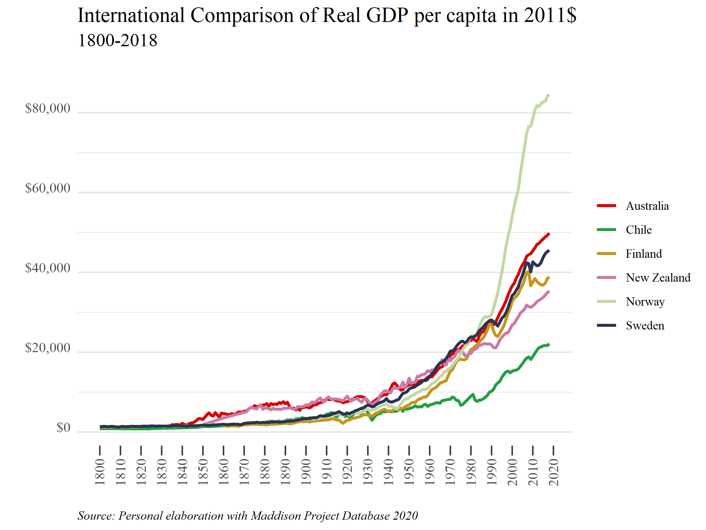

<style>
body {
text-align: justify}
</style>

# Librerías 

```{r}
library(readxl)
library(ggplot2)
library(plotly)
library(Cairo)
library(scales)
library(ggthemes)
library(dplyr)

```

# Base de Datos
## Importamos
Obtenemos la base desde [Maddison Project Database 2020
](https://www.rug.nl/ggdc/historicaldevelopment/maddison/releases/maddison-project-database-2020). Luego, la importamos.

```{r}
mpd2020 <- as.data.frame(read_excel("mpd2020.xlsx", sheet = "Full data"))

```

## unique()
El siguiente comando puede ser útil para realizar la selección de países. En este caso, compararemos el crecimiento de Chile con el de Noruega, Suecia, Finlandia, Nueva Zelanda y Australia.

```{r, results='hide'}
unique(mpd2020[c("countrycode", "country")])

```

## summary()
Con el siguiente comando nos interesa ver el período que comprenderá el gráfico, tomando en cuenta los datos disponibles para Chile. 

```{r, results='hide'}
  mpd2020 %>% 
  filter(countrycode == "CHL") %>%
  summary()
```

Vemos que hay datos para Chile desde 1800, por lo que el gráfico iniciará desde ese año.

## filter()
Dada la información de los dos pasos anteriores, filtramos la base para dejarla con lo que necesitamos. Podemos crear una nueva por si llegáramos a necesitar la base completa para alguna otra cosa.

```{r}
df_graf1 <- mpd2020 %>%
  filter(countrycode %in% c("CHL", "NOR", "SWE", "FIN", "NZL", "AUS"),
         year>=1800)

```

# Gráfico
## ggplot()

```{r}
my_palette = c("#DA0000", "#239f40", "#C4961A", "#CC79A7", "#C3D7A4", "#293352")

g1 <- ggplot(data = df_graf1, aes(year, gdppc, color=country)) +
  geom_line(size = 1) +
  labs(title = "International Comparison of Real GDP per capita in 2011$",
       subtitle = "1800-2018",
       caption = "Source: Personal elaboration with Maddison Project Database 2020",
       x = "",
       y = "",
       col = NULL) +
  scale_color_manual(values = my_palette) +
  scale_x_continuous(breaks=seq(1800,2020, by = 10), position = "bottom") +
  scale_y_continuous(labels = dollar) +
  theme_tufte() +
  theme(plot.title = element_text(size = rel(1.4)),
        plot.subtitle = element_text(size = rel(1.2), margin=margin(0,0,20,0)),
        plot.caption = element_text(hjust = 0, face= "italic"),
        axis.text.x = element_text(angle = 90, vjust=.5, size = 10),
        axis.text.y = element_text(angle = 0, vjust=0, size = 10),
        axis.ticks.length.x = unit(.25, "cm"),
        axis.ticks.x = element_line(size = .5),
        axis.ticks.y = element_blank(),
        panel.grid.major.y = element_line(colour = "grey90"),
        panel.grid.minor.y = element_line(colour = "grey90"))

```

```{r, echo=FALSE}
# Para guardar en formato png
ggsave(g1, filename = "plot.png", type = 'cairo', dpi = 300,
 width = 18, height = 13.5, units = "cm")

# Para guardar con más calidad (pdf o eps)
ggsave(g1, filename = "plot.pdf", device = cairo_pdf, dpi = 300,
 width = 18, height = 13.5, units = "cm")

ggsave(g1, filename = "plot.eps", device = cairo_ps, dpi = 300,
 width = 18, height = 13.5, units = "cm")
```

```{r, echo=FALSE}


```

## plotly()
Con este comando obtenenmos un gráfico interactivo.

```{r}
fig <- ggplotly(g1)
fig
```


# Código

```{r ref.label=knitr::all_labels(), echo = T, eval = F}
```

# Referencias

* [ggplot2](https://ggplot2.tidyverse.org/reference/index.html)
* [ggplotly](https://plotly.com/ggplot2/)
* [Maddison Project Database 2020](https://www.rug.nl/ggdc/historicaldevelopment/maddison/releases/maddison-project-database-2020)