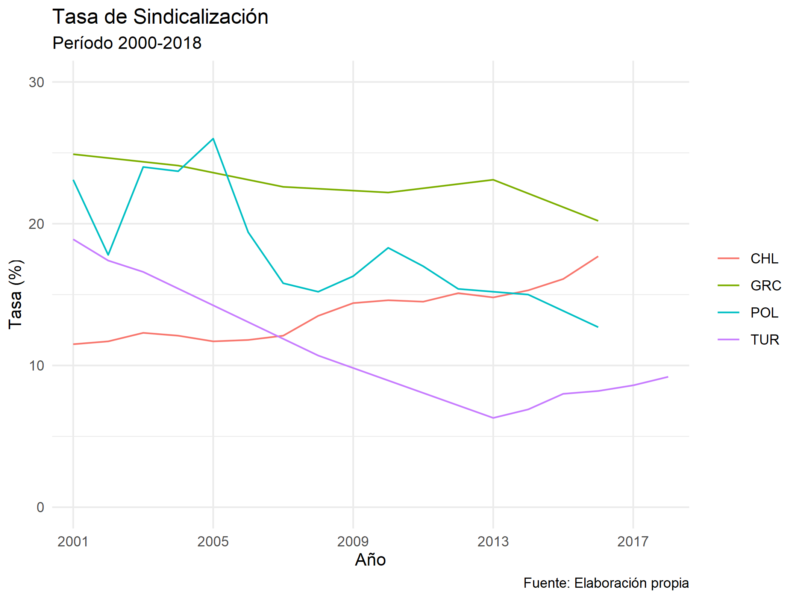

<style>
body {
text-align: justify}
</style>

# Paso a paso

## Librerías

```{r, echo=TRUE}
library(OECD)
library(tidyverse)
library(Hmisc)
library(skimr)

```

## Análisis de la base

La base la obtendremos desde la librería *OECD*. A menos que conozcamos la sigla exacta de la base a utilizar, se recomienda crear un *dataframe*, que nombraremos *df*, con todas las bases disponibles que nos otorga la librería *OECD* y buscar en este la base que queramos. Para esto último, buscaremos *"union"*, dado que en inglés a los sindicatos se les denomina *trade union*.

```{r, echo=TRUE}
df <- get_datasets()
search_dataset("union", data = df)

```

Identificamos nuestra base de interés (*TUD*), la descargamos y la exploramos. Para esto último, utilizamos el comando **skim()** y **describe()**.

```{r, echo=TRUE, results='hide'}
df <- get_dataset("TUD")

skim(df)
describe(df)

```

Luego del análisis, realizamos algunos filtros para quedarnos con las variables y categorías de interés. Seleccionamos algunos países, un período más acotado y la unidad con que trabajaremos (*PC*, por porcentaje).

```{r, echo=TRUE}
df <- subset(df, select = c("COU", "SOURCE", "UNIT", "obsTime", "obsValue")) %>%
  filter(COU %in% c("CHL", "GRC", "POL", "TUR"), UNIT == "PC", obsTime>2000)

```

## Gráfico

```{r, echo=TRUE}
g1 <- ggplot(df, aes(obsTime, obsValue, group = COU)) +
  geom_line(aes(color = COU)) +
  labs(title = "Tasa de Sindicalización",
       subtitle = "Período 2000-2018",
       caption = "Fuente: Elaboración propia",
       col = NULL) +
  xlab("Año") +
  ylab("Tasa (%)") +
  scale_x_discrete(breaks = c(2001, 2005, 2009, 2013, 2017)) +
  scale_y_continuous(limits = c(0, 30)) +
  theme_minimal()

```

```{r, echo=FALSE}
# Para guardar en formato png
ggsave(g1, filename = "plot.png", type = 'cairo', dpi = 300,
 width = 18, height = 13.5, units = "cm")

```

```{r, echo=FALSE}


```

# Código

```{r ref.label=knitr::all_labels(), echo = T, eval = F}
```
