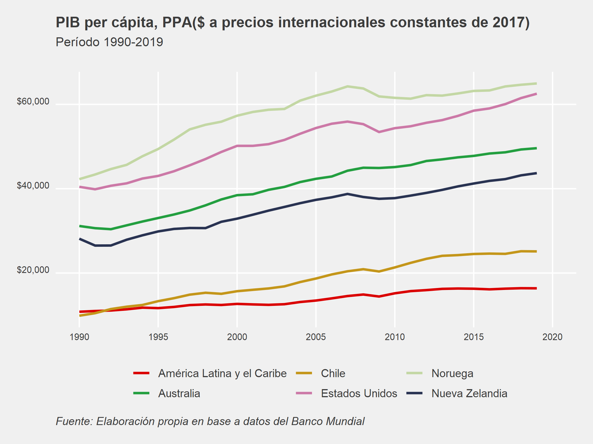

<style>
body {
text-align: justify}
</style>

# Librerías 

```{r}
library(WDI)
library(dplyr)
library(ggplot2)
library(ggthemes)
library(Cairo)
library(scales)

```

# Base de Datos

## Búsqueda
El comando **WDIsearch()** se utiliza para buscar las bases de interés con palabras clave. En este caso, estamos interesados en comparar el PIB per cápita real de Chile, medido a PPP, por lo que nuestras palabras claves serán *gdp*, *ppp* y *constant*. Lo anterior se traduce en lo siguiente:

```{r}
WDIsearch('gdp.*ppp.*constant')

```

Dadas las 5 opciones que nos muestra el resultado, para efectos de este artículo, nos quedaremos con la número 4: *"GDP per capita, PPP (constant 2017 international $)"*.

## Descarga
Con el siguiente comando podemos obtener la base y aplicar filtros previos.

```{r}
df <- WDI(
  country = "all",
  indicator = "NY.GDP.PCAP.PP.KD",
  start = 1990,
  end = 2020,
  extra = FALSE,
  cache = NULL,
  latest = NULL,
  language = "es"
)

```

## Modificaciones

### unique()/filter()
Con el comando **unique()** vemos los códigos de los países para hacer la selección y después aplicamos **filter()**. 

```{r, results='hide'}
unique(df[c("iso2c", "country")])
```

```{r}
df <- filter(df, iso2c %in% c("ZJ", "AU", "CL", "NZ", "NO", "US"))

```

### rename()
Con **rename()** podemos modificar el nombre de las variables.

```{r}
df <- rename(df, gdp_pc = NY.GDP.PCAP.PP.KD)

```

### mutate()/recode()
Con estos comandos podemos cambiar los nombres de las categorías.

```{r}
df <- df %>% mutate(country = recode(country,
                            "América Latina y el Caribe" = "América Latina y el Caribe"))
```

## Análisis
Analizamos el ranking de los países según PIB per cápita para el año 2019.

```{r}
df %>% 
  filter(year == 2019) %>%
  select(country, gdp_pc) %>%
  arrange(-gdp_pc) %>% 
  head(6)

```

Comparamos el PIB per cápita de Chile con Nueva Zelandia en 1990 y 2015.

```{r}
df %>% 
  filter(year %in% c(1990,2015) & iso2c %in% c("CL","NZ")) %>%
  select(country, year, gdp_pc)

```

# Gráfico

```{r}
my_palette = c("#DA0000", "#239f40", "#C4961A", "#CC79A7", "#C3D7A4", "#293352")

g1 <- ggplot(df, aes(year, gdp_pc, color=country)) +
  geom_line(size = 1) +
  labs(title = "PIB per cápita, PPA($ a precios internacionales constantes de 2017)",
       subtitle = "Período 1990-2019",
       caption = "Fuente: Elaboración propia en base a datos del Banco Mundial",
       col = NULL) +
  scale_color_manual(values = my_palette) +
  scale_x_continuous(breaks=seq(1990,2020, by = 5)) +
  scale_y_continuous(labels = dollar) +
  theme_fivethirtyeight() +
  theme(plot.title = element_text(size = rel(1.05)),
        plot.subtitle = element_text(size = rel(.9), margin=margin(0,0,20,0)),
        plot.caption = element_text(hjust = 0, face= "italic"),
        axis.text.x = element_text(angle = 0, vjust=1, size = 8),
        axis.text.y = element_text(angle = 0, vjust=0, size = 8),
        legend.position = "bottom",
        panel.grid.major = element_line(colour = "white"))

```

```{r, echo=FALSE}
# Para guardar en formato png
ggsave(g1, filename = "plot.png", type = 'cairo', dpi = 300,
 width = 18, height = 13.5, units = "cm")

# Para guardar con más calidad (pdf o eps)
ggsave(g1, filename = "plot.pdf", device = cairo_pdf, dpi = 300,
 width = 18, height = 13.5, units = "cm")

ggsave(g1, filename = "plot.eps", device = cairo_ps, dpi = 300,
 width = 18, height = 13.5, units = "cm")
```

```{r, echo=FALSE}

```

# Código

```{r ref.label=knitr::all_labels(), echo = T, eval = F}
```

# Referencias

* [ggplot2](https://ggplot2.tidyverse.org/reference/index.html)
* [WDI](https://vincentarelbundock.github.io/WDI/)